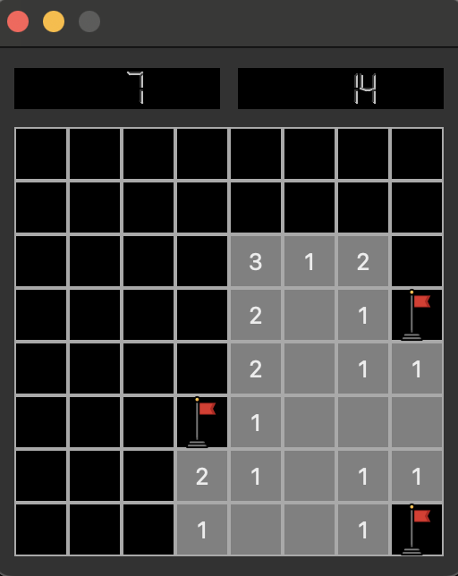
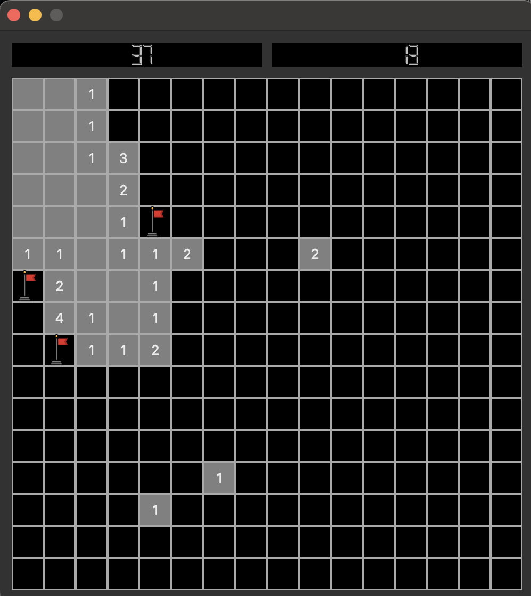

# minesweeper

C++/Qt implementation of minesweeper





## Build Instructions (MacOS/Linux)

```bash
git clone https://github.com/2umanyan/minesweeper
cd minesweeper
mkdir build
cd build
cmake ..
cmake --build .
```
